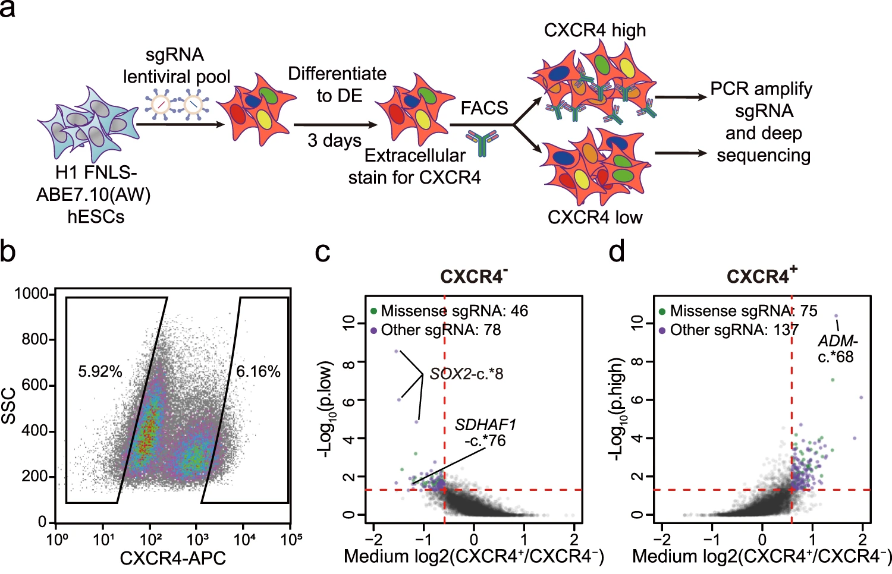

# Parallel functional assessment of m6A sites in human endodermal differentiation with base editor screens

N6-methyladenosine (m6A) plays important role in lineage specifications of embryonic stem cells. However, it is still difficult to systematically dissect the specific m6A sites that are essential for early lineage differentiation. Here, we develop an adenine base editor-based strategy to systematically identify functional m6A sites that control lineage decisions of human embryonic stem cells. We design 7999 sgRNAs targeting 6048 m6A sites to screen for m6A sites that act as either boosters or barriers to definitive endoderm specification of human embryonic stem cells. We identify 78 sgRNAs enriched in the non-definitive endoderm cells and 137 sgRNAs enriched in the definitive endoderm cells. We successfully validate two definitive endoderm promoting m6A sites on SOX2 and SDHAF1 as well as a definitive endoderm inhibiting m6A site on ADM. Our study provides a functional screening of m6A sites and paves the way for functional studies of m6A at individual m6A site level.


## sgRNA design
### STEP1 sequence abstract for sgRNA design
```
    sequence around single base m6A site abstract by bedtools getfasta
```
### STEP2 PAM sequence design
```
    python sgRNA_design.py
```

## sgRNA analysis pipeline
### STEP1 constant sequences of flanking sgRNA sequences
```

    cutadapt -j 6 -q 10 -g GGACGAAACACCG -o CXCR4_minus_Rep1_end.fastq CXCR4_minus_Rep1.fastq
    cutadapt -j 6 -q 10 -g GGACGAAACACCG -o CXCR4_minus_Rep2_end.fastq CXCR4_minus_Rep2.fastq
    cutadapt -j 6 -q 10 -g GGACGAAACACCG -o CXCR4_minus_Rep3_end.fastq CXCR4_minus_Rep3.fastq
    cutadapt -j 6 -q 10 -g GGACGAAACACCG -o CXCR4_plus_Rep1_end.fastq CXCR4_plus_Rep1.fastq
    cutadapt -j 6 -q 10 -g GGACGAAACACCG -o CXCR4_plus_Rpe2_end.fastq CXCR4_plus_Rpe2.fastq
    cutadapt -j 6 -q 10 -g GGACGAAACACCG -o CXCR4_plus_Rpe3_end.fastq CXCR4_plus_Rpe3.fastq
    
    
    cutadapt -j 6 -q 10 -a GTTTTAGAGCTAG -o CXCR4_minus_Rep1_start.fastq CXCR4_minus_Rep1_end.fastq
    cutadapt -j 6 -q 10 -a GTTTTAGAGCTAG -o CXCR4_minus_Rep2_start.fastq CXCR4_minus_Rep2_end.fastq
    cutadapt -j 6 -q 10 -a GTTTTAGAGCTAG -o CXCR4_minus_Rep3_start.fastq CXCR4_minus_Rep3_end.fastq
    cutadapt -j 6 -q 10 -a GTTTTAGAGCTAG -o CXCR4_plus_Rep1_start.fastq CXCR4_plus_Rep1_end.fastq
    cutadapt -j 6 -q 10 -a GTTTTAGAGCTAG -o CXCR4_plus_Rpe2_start.fastq CXCR4_plus_Rpe2_end.fastq
    cutadapt -j 6 -q 10 -a GTTTTAGAGCTAG -o CXCR4_plus_Rpe3_start.fastq CXCR4_plus_Rpe3_end.fastq
```
### STEP2 MAGeCK count
```
    mageck count -l m6A_base_editing_lib_modify.csv -n H1_ABE_m6A_modify --sample-label CXCR4minus_Rep1,CXCR4minus_Rep2,CXCR4minus_Rep3,CXCR4plus_Rep1,CXCR4plus_Rpe2,CXCR4plus_Rpe3 --fastq CXCR4minus_Rep1.fastq CXCR4minus_Rep2.fastq CXCR4minus_Rep3.fastq CXCR4plus_Rep1.fastq CXCR4plus_Rpe2.fastq CXCR4plus_Rpe3.fastq
```

### STEP3 MAGeCK test
```
    mageck test -k H1_ABE_m6A_modify.count.txt -t CXCR4plus_Rep1,CXCR4plus_Rpe2,CXCR4plus_Rpe3 -c CXCR4minus_Rep1,CXCR4minus_Rep2,CXCR4minus_Rep3 -n H1_ABE_m6A_modify_change
```
### STEP4 medium log2-foldchange count and min counts cutoff
```
    python medium_log2foldchange.py --mageck_test_sgrna_summary_result H1_ABE_m6A_modify_change.sgrna_summary.txt --mageck_count_normalized_result H1_ABE_m6A_modify.count_normalized.txt --min_depth 200 --output_file H1_ABE_m6A_modify_change.sgrna_summary_with_medium_lfc.txt
```
### STEP5 sgRNA induced mutations predict
```
    (1): sgRNA induced mutations predict by VEP (Ensembl Variant Effect Predictor)
    (2): python sgRNA_resulted_varient_annotation_select.py --VEP_result_file ABE_mutation_predict.txt --sgRNA_varient_file H1_ABE_modify_annotation_select.txt --mageck_result_file  H1_ABE_m6A_modify_change.sgrna_summary_with_medium_lfc.txt --output_file H1_ABE_m6A_modify_change.sgrna_summary_with_varient_annotation.txt
```
### STEP6 define change sgRNA between CXCR4+ and CXCR4-
```
    python change_sgRNA_annotation.py H1_ABE_m6A_modify_change.sgrna_summary_with_varient_annotation.txt >> H1_ABE_m6A_modify_change.sgrna_summary_with_change_sgRNA_define.txt
```
### Citing
```
If you use code in your research, please cite:
"Cheng W, Liu F, Ren Z, Chen W, Chen Y, Liu T, Ma Y, Cao N, Wang J. Parallel functional assessment of m6A sites in human endodermal differentiation with base editor screens. Nat Commun. 2022 Jan 25;13(1):478. doi: 10.1038/s41467-022-28106-0. PMID: 35078991; PMCID: PMC8789821.".
```
### Contributor
This package is developed and maintaned by Jinkai Wang and Zhijun Ren. If you want to contribute, please leave an issue or submit a pull request. We appreciate contributions on bug fixes and potential new features. Thank you !


### License
m6Aiso is licensed under the terms of the MIT license.


